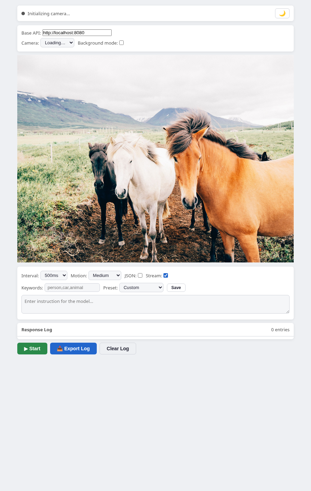

# Vidit



Real-time camera surveillance and scene analysis using llama.cpp server with a multimodal vision model

## Prerequisites

- [llama.cpp](https://github.com/ggml-org/llama.cpp) installed
- A browser that supports `navigator.mediaDevices.getUserMedia` (Chrome, Firefox, Edge, or Safari)
- [Node.js](https://nodejs.org) (for the HTTPS server)

## How to run

### 1. Start the vision model server

```sh
llama-server -hf ggml-org/SmolVLM-500M-Instruct-GGUF -ngl 99
```

The server starts on `http://localhost:8080` by default. Add `-ngl 99` for GPU acceleration (NVIDIA/AMD/Intel). See also [other multimodal models](https://github.com/ggml-org/llama.cpp/blob/master/docs/multimodal.md).

### 2. Start the HTTPS page server

```sh
node server.js
```

This serves the page over HTTPS at `https://localhost:8443` with:
- **TLS 1.3 only** — no fallback to older protocols
- **ECDSA P-384 self-signed certificate** — auto-generated on first run
- **Security headers** — HSTS, `X-Content-Type-Options: nosniff`, `X-Frame-Options: DENY`, `Referrer-Policy: no-referrer`
- **CSP in HTML** — `default-src 'self'` with proper allowlists for camera, API, and Web Worker

Open `https://localhost:8443` in your browser. Accept the self-signed certificate warning (since the cert is generated locally).

> **Why the warning?** The certificate is self-signed — your browser can't verify it against a public Certificate Authority, so it shows a warning. This is normal and safe for local use. The connection is still encrypted with TLS 1.3 and a P-384 key. To eliminate the warning, use [`mkcert`](https://github.com/FiloSottile/mkcert) to generate a locally-trusted certificate: `mkcert -key-file key.pem -cert-file cert.pem localhost 127.0.0.1`.

> You can also open `index.html` directly from the filesystem (`file://`), but camera access may be restricted depending on the browser.

### 3. Start the page

Click **Start** and grant camera permission when prompted.

## User parameters

| Parameter | Default | Description |
|---|---|---|
| **Base API** | `http://localhost:8080` | llama.cpp server URL |
| **Camera** | first device | Webcam selection from `enumerateDevices()` |
| **Background mode** | off | Uses a Web Worker to avoid timer throttling when the tab is backgrounded |
| **Interval** | 500ms | Delay between frame captures (100ms–5s) |
| **Motion sensitivity** | Medium (2) | Motion-gated capture. Levels: Disabled, Low, Medium, High, Very High. Skips API calls when nothing changes. |
| **JSON mode** | off | Checkbox hint — pair with a JSON instruction preset |
| **Stream mode** | on | Uses SSE (`stream: true`) to render tokens incrementally via `ReadableStream` |
| **Keywords** | (empty) | Comma-separated alert triggers. Matched responses highlight the log entry, flash the title, play a beep, and fire a browser notification. |
| **Preset** | Custom | Built-in: *Describe scene*, *JSON objects*, *Surveillance*. Custom presets saved to localStorage. |
| **Instruction** | (user-set) | Text prompt sent with each frame |

### Keyboard shortcuts

| Key | Action |
|---|---|
| **Space** | Start / Stop |
| **I** | Focus instruction field |
| **Ctrl+E / Cmd+E** | Export response log as JSON |
| **D** | Toggle dark mode |

## Security

- **Content Security Policy** — CSP meta tag restricts resource origins, blocks inline event handlers and `javascript:` URLs
- **TLS 1.3 only** — the built-in server (`server.js`) accepts no connection below TLS 1.3, with only AEAD cipher suites
- **ECDSA P-384 cert** — self-signed certificate uses a NIST P-384 key (generated on first `node server.js`)
- **No dependencies** — the server uses only Node.js built-in modules; zero npm packages
- **Local by default** — all camera frames stay on your machine; no telemetry, no external calls beyond the configured API URL
